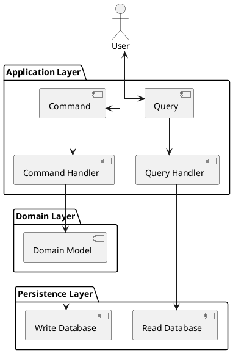
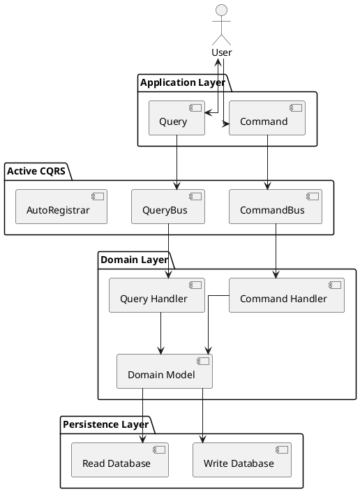

# Active CQRS

`active_cqrs` is a lightweight Ruby gem that introduces **CQRS (Command Query Responsibility Segregation)** into your Rails applications. To keep with familiarity and common Rails conventions, Active CQRS builds directly ontop of ActiveRecord. It intends to enforce a clean separation between commands (write operations) and queries (read operations), enabling better scalability and maintainability.

---

## What is CQRS?

**CQRS** stands for **Command Query Responsibility Segregation**, a pattern that separates read and write responsibilities into different models or services.

### CQRS vs ActiveRecord

| Feature | CQRS | ActiveRecord |
|--------|------|--------------|
| Write logic | Encapsulated in Command + Handler | In model callbacks or controllers |
| Read logic | Encapsulated in Query + Handler | Often mixed in models or controllers |
| Separation of concerns | ✅ Yes | ❌ No |
| Testability | ✅ High | ⚠️ Mixed |
| Performance tuning | ✅ Fine-grained | ⚠️ Monolithic |
| Domain logic isolation | ✅ Clear | ❌ Often leaky |

---

## Pitfalls

### ActiveRecord
- Logic is mixed in models/controllers.
- Hard to maintain as apps grow.
- Difficult to test in isolation.

### CQRS
- More boilerplate (partially solved by this gem).
- Might be overkill for simple CRUD apps.

---

## When to Use CQRS

Use CQRS if:
- You're building a large or growing Rails app.
- You want strong separation between reads/writes.
- You're scaling to microservices or event sourcing.

Avoid if:
- Your app is very small or CRUD-heavy.
- You don’t want added architectural complexity.

---

## Active CQRS Design





---

## Installation

Add this line to your Gemfile:

```ruby
gem 'active_cqrs'
```

Then run:

```sh
bundle install
```

---

## Setup

Run the installer:

```sh
rails generate cqrs:install
```

This creates:

```ruby
# config/initializers/cqrs.rb
CQRS_COMMAND_BUS = ActiveCqrs::CommandBus.new
CQRS_QUERY_BUS   = ActiveCqrs::QueryBus.new

ActiveCqrs::AutoRegistrar.new(
  command_bus: CQRS_COMMAND_BUS,
  query_bus:   CQRS_QUERY_BUS
).call
```

### Logging

In `config/initializers/cqrs.rb`:

```ruby
ActiveCqrs::Logger.enabled = Rails.env.development?
```

You’ll see logs like:

```
[CQRS] Loaded handler file: app/handlers/commands/create_user_handler.rb
[CQRS] Registered CreateUserHandler for CreateUserCommand
```

---

## Usage

### Generate a Command

```sh
rails generate cqrs:command CreateUser
```

This creates:

```ruby
# app/commands/create_user_command.rb
class CreateUserCommand
  attr_reader :attributes
  def initialize(attributes = {})
    @attributes = attributes
  end
end
```

```ruby
# app/handlers/commands/create_user_handler.rb
class CreateUserHandler
  def call(command)
    User.create!(command.attributes)
  end
end
```

### Generate a Query

```sh
rails generate cqrs:query GetUser
```

---

### Using Actve CQRS

The Command and Query buses are defined globally. This means you can seamlessly integrate Active CQRS into your architecture.

Wherever it is called from, the pattern is:

```
Create command instance -> execute with command bus
Create query instance -> execute with query bus
```

```ruby
    command = CreateUserCommand.new(
      name: params[:name],
      email: params[:email]
    )

    user = CQRS_COMMAND_BUS.call(command)
```

```ruby
    query = GetUserQuery.new(id: params[:id])
    user = CQRS_QUERY_BUS.call(query)
```

### Use Active CQRS in Your Controller

```ruby
class UsersController < ApplicationController
  def create
    command = CreateUserCommand.new(
      name: params[:name],
      email: params[:email]
    )

    user = CQRS_COMMAND_BUS.call(command)

    render json: user, status: :created
  rescue ActiveRecord::RecordInvalid => e
    render json: { errors: e.record.errors.full_messages }, status: :unprocessable_entity
  end

  def show
    query = GetUserQuery.new(id: params[:id])
    user = CQRS_QUERY_BUS.call(query)

    if user
      render json: user
    else
      render json: { error: "User not found" }, status: :not_found
    end
  end
end

```

### Use Active CQRS from a Service Context

```ruby
# app/services/create_user_service.rb
class CreateUserService
  def initialize(name:, email:)
    @name = name
    @email = email
  end

  def call
    command = CreateUserCommand.new(
      name: @name,
      email: @email
    )

    CQRS_COMMAND_BUS.call(command)
  rescue ActiveRecord::RecordInvalid => e
    handle_validation_failure(e)
  end

  private

  def handle_validation_failure(exception)
    # Custom error handling logic
    raise exception
  end
end

```

### Use Active CQRS in a Custom Middleware

```ruby
def dispatch_command(command)
  Rails.logger.info("Dispatching #{command.class.name}")
  CQRS_COMMAND_BUS.call(command)
rescue => e
  Rails.logger.error("Command failed: #{e.message}")
  raise
end

def execute_query(query)
  Rails.logger.info("Querying #{query.class.name}")
  CQRS_QUERY_BUS.call(query)
end

```

## Advanced CQRS Design

Active CQRS is flexible enough to expand into a more robust underlying data strategy. The developer can determine how broadly or robust separation should be implemented. By design, generated handlers are open to any implementation.

### Practical Implementation Advice

**Use Read/View Models for Queries**

```ruby
class UserView
  def self.find_by_id(id)
    User.select(:id, :name, :email).find_by(id: id)
  end
end
```

**Enforce Read-Only Model for Queries**

```ruby
class UserView < ApplicationRecord
  self.table_name = "users"
  def readonly?
    true
  end
end
```

**Use POROs, DTOs, or serialized Return Types to Obfuscate Active Record**

```ruby
def call(query)
  user = User.find_by(id: query.criteria[:id])
  return nil unless user

  OpenStruct.new(id: user.id, name: user.name, email: user.email)
end

```

---

## License

MIT

## Contributing

Pull requests welcome!
